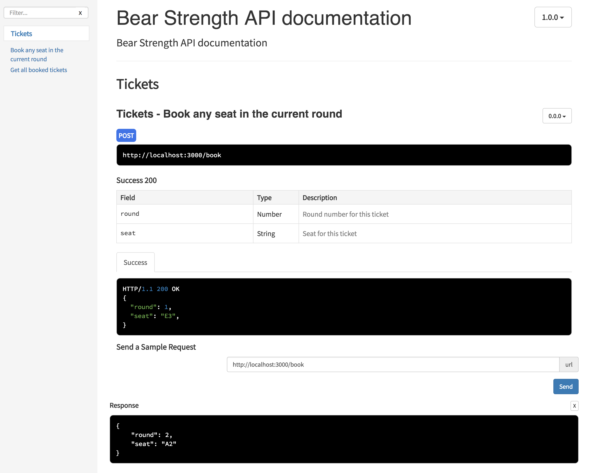

# Bear Strength Reference Implementation
[](https://travis-ci.org/bigbearsio/strength-ref)

From this project: https://github.com/bigbearsio/strength

A reference implementation of expected functional behavior of the service. 

This is neither performant nor thead safe but it should serve as a documentation of how the service is expected to behave. 

## Prerequisite
* NodeJS

## Running
* Clone the project
* `npm install` or `yarn`
* `npm start` or `yarn start`
* Browse to `http://localhost:3000/apidoc`



## Pushing Code
Run API Doc first before pushing code to repo
```npm run apidoc```
